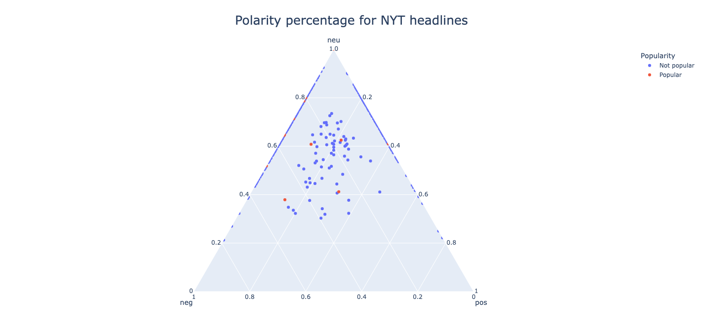

# Popularity and polarity of articles

## Project Abstract

My project 1) predicts whether an article will be 'popular' or 'unpopular' given its headline and 2) examines the polarity of popuar and unpopular article headlines to explore any significant difference between the two. I extracted articles from the past 30 days from the NYT Most Popular API and labeled these 'popular'. The articles I extracted from the past 30 days that were absent from the NYT Most Popular API but included in the NYT Archive API were labeled 'unpopular'.

For the first part of my project, I use the Gaussian Naives Bayes Classifier to train a set of the 'popular' and 'unpopular' headlines to predict whether an article based on its headline will be popular or not. For the second part of my project, I use NLTK's Sentiment Analysis using VADER (Valence Aware Dictionary for Sentiment Reasoning) to score the polarity of headlines. I then visualize the headlines' polarity scores on a ternary scatter plot with axes neutral, negative, and positive.

I also include an Article class to easily obtain the compound polarity score for an article with a specific headline. This is useful to check the visualizations. Helper methods are also included to assist with determining which articles from the achived articles API matches the timeframe of the most popular articles API (which only includes articles from the last 30 days). 

## Conclusion

The model's accuracy was 0.972, indicating that certain words in the headline can attract more readers than others and garner more clicks. Visualizations showed that the average polarity score of popular headlines was significantly more negative than that of non popular headlines. The ternary scatter plot also showed that popular headlines tended to have more negative words than positive words. Based on these results, the language used in article headlines can offer insight into what readers feel more compelled to click and read. A limitation to this project was that the number of articles in the NYT Most Popular API was significantly less than the number of articles in the NYT Archive API. More raw data points would have been more beneficial to the machine learning aspect of the project.

### Note

A NYT API key is needed in order to access the API. The key I use is included in the main function.
There is an API call limit at 4,000 requests per day and 10 requests per minute.

### Modules
- json
- requests
- nltk
- pandas
- numpy
- plotly
- sklearn
